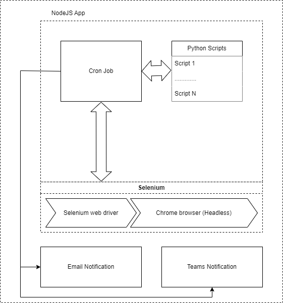

# Selenium automation tool

Using the Selenium web driver and Chrome driver, we have created an automation tool for testing all our web applications on a pre-defined schedule. This is a NodeJS application with a CRON scheduler. The CRON job executes each Python script (specific to each web application) and relays back the messages to the tool on completion or failure of the multiple tasks we set in each script. Once all the scripts are executed and the automation tool receives the messages relayed back, then it will consolidate all the messages and send an email and Teams notification to notify all the team members. The application architecture allows us to add new scripts in the future in our tools dedicated folder, which will not require any changes/updates in the application code. We can develop and test our script outside of this tool but need to follow the technical guidelines and workflow of this tool while developing the script accordingly.

